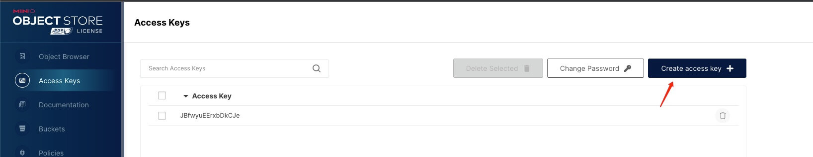
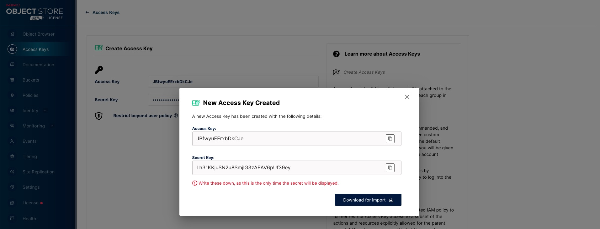
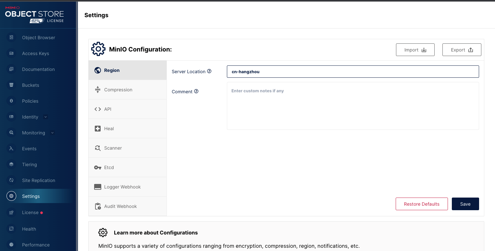
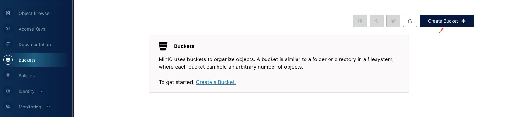

# 环境准备

todo@erguotou

## NodeJs

在 Fireboom 中使用 NodeJs 钩子时，你需要提前准备 NodeJs 环境。

* 如果你使用的是 Windows 系统，请前往[https://nodejs.org/en/download/](https://nodejs.org/en/download/)下载安装最新 NodeJs
* 如果你是 MacOs 或 Linux 系系统，建议使用 `nvm` 进行安装

```console
curl -o- https://raw.githubusercontent.com/nvm-sh/nvm/v0.39.3/install.sh | bash
export NVM_DIR="$([ -z "${XDG_CONFIG_HOME-}" ] && printf %s "${HOME}/.nvm" || printf %s "${XDG_CONFIG_HOME}/nvm")"
[ -s "$NVM_DIR/nvm.sh" ] && \. "$NVM_DIR/nvm.sh" # This loads nvm
nvm install stable
```

安装完成后使用命令检查

```console
# 尽量大于16
node -v
```

## 文件存储 S3

在 Fireboom 的最佳实践中，文件存储、读取、转换等工作应该全部交由 S3 来处理，Fireboom 支持所有兼容 S3 协议的服务，在使用前你需要先准备 S3 服务的配置，下面是常见的 S3 服务商的配置获取方法。

### 阿里云

### 腾讯云

### AWS

### 自部署 minio

参考官方文档[https://min.io/download](https://min.io/download)完成安装，打开控制台页面，点击`Access Keys`，点击`Create access key`，创建一条新的认证配置信息，复制并粘贴到 Fireboom 中。&#x20;

<figure><figcaption></figcaption></figure>

<figure><figcaption></figcaption></figure>

服务地址一般为 `http://[minio-server].ip:9000` 区域在 minio 控制台，点击`Settings`，在默认`Region`面板右侧的`Server location`中填写并复制到 Fireboom中&#x20;

&#x20;

<figure><figcaption></figcaption></figure>

桶名称在 minio 控制台， 点击`Buckets`，点击`Create bucket`，根据提示完成创建&#x20;

<figure><figcaption></figcaption></figure>

## 身份认证 OIDC

在 Fireboom 的最佳实践中，用户登录、授权、校验、角色管理等都应该交由 OIDC 服务来处理，Fireboom 支持常见的一些 OIDC 服务商，在使用前你需要先准备好其中的一个或多个服务，下面是部分常见服务商的配置获取方法。

### Authing

### Auth0

### 自部署
