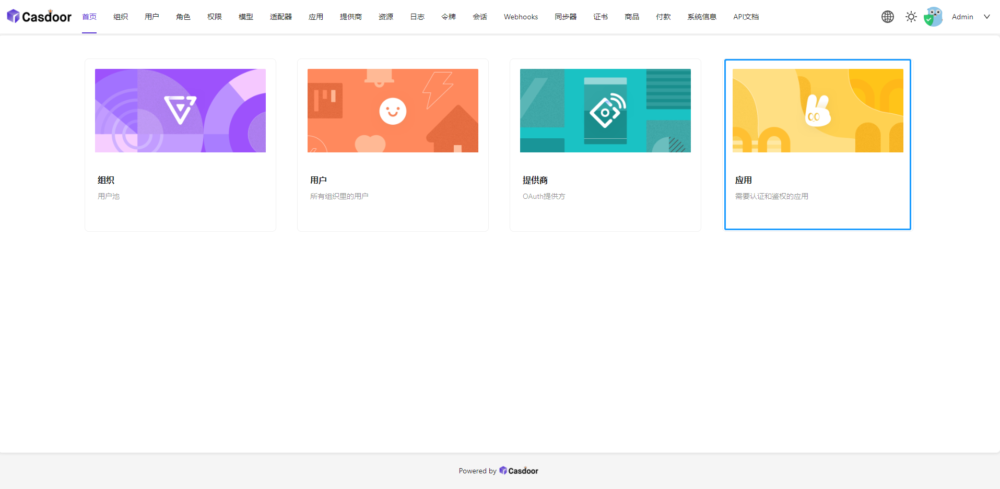
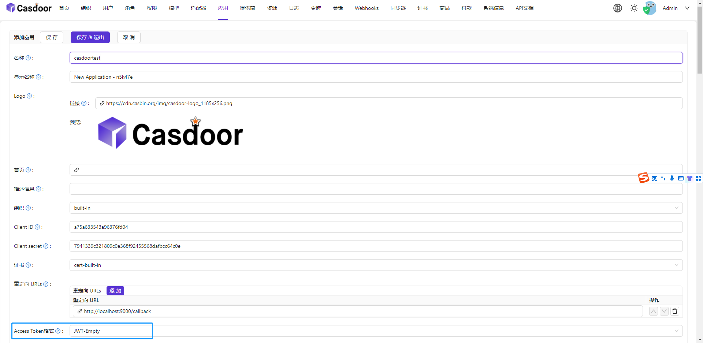
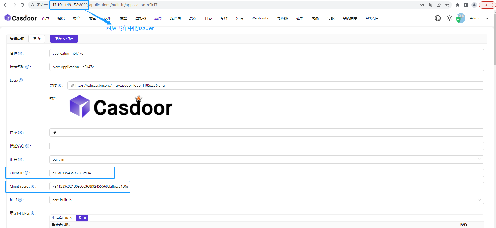
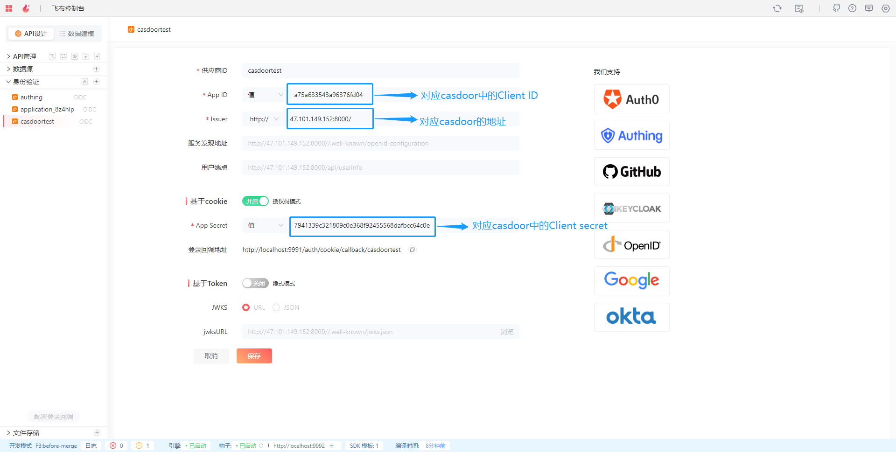

# 身份认证 OIDC

### Authing

进入Authing官网https://console.authing.cn/，在应用-自建应用页面，创建一个自建应用

<figure><figcaption></figcaption></figure>

查看已创建应用的配置信息

<figure><figcaption></figcaption></figure>

配置登录回调 URL：http://localhost:9991/auth/cookie/callback/authing（其中auth0可修改为其他）

<figure><figcaption></figcaption></figure>

在飞布身份验证模块，进行新增身份验证操作，将Authing中获取的信息填写至对应的输入框中，保存完成即可（新增页面的供应商ID对应登录回调地址中的authing）

<figure><figcaption></figcaption></figure>

&#x20;

### Auth0

进入Auth0官网https://manage.auth0.com/，在Applications页面选择或新建一个应用

<figure><figcaption></figcaption></figure>

&#x20;

查看已创建应用的配置信息

&#x20;

<figure><figcaption></figcaption></figure>

&#x20;

配置Allowed Callback URLs：http://localhost:9991/auth/cookie/callback/auth0（其中auth0可修改为其他）

&#x20;

<figure><figcaption></figcaption></figure>

在飞布身份验证模块，进行新增身份验证操作，将Auth0中获取的信息填写至对应的输入框中，保存完成即可（新增页面的供应商ID对应Allowed Callback URLs中的auth0）

<figure><figcaption></figcaption></figure>

### 自部署Casdoor

进入casdoor主页，点击应用入口，进行添加应用操作

在添加应用页面，可以对默认生成的名称等信息进行修改操作，Access Token格式需修改为JWT-Empty，完成注册项的配置后进行保存操作

查看已创建应用的配置信息

在飞布身份验证模块，进行新增身份验证操作，将Casdoor中获取的信息填写至对应的输入框中，保存完成即可（新增页面的供应商ID对应登录回调地址中的casdoortest）

在Casdoor中配置登录回调 URL：http://localhost:9991/auth/cookie/callback/casdoortest（其中casdoortest对应飞布中的供应商ID）

### 自部署Logto

Logoto 作为 Auth0 的开源替代方案，致力于为所有企业和个人提供面向未来的身份认证体系。我们以 Logto 的开源版本为例介绍如何接入 Fireboom。

1.  按照 [Github 中的说明](https://github.com/logto-io/logto#launch-logto)安装好 Logto，打开 [http://localhost:3002](http://localhost:3002) 访问 Logto 后台并初始化一个管理员账号\

    <figure><figcaption></figcaption></figure>
2. 登录后点击这里切换下语言\
   .png>)
3.  点击“全部应用”，选择“传统网页应用”创建一个应用\

    <figure><figcaption></figcaption></figure>
4.  跳过示例，在应用信息页修改应用名称，并添加“重定向 URIs”，该值可以从 Fireboom 认证源页面获取到（在第5步图中可以看到登录回调地址为 [http://localhost:9991/auth/cookie/callback/logto](http://localhost:9991/auth/cookie/callback/logto) ）\

    <figure><figcaption></figcaption></figure>
5.  在 Fireboom 中添加一个身份认证源，配置信息如下\

    <figure><figcaption></figcaption></figure>
