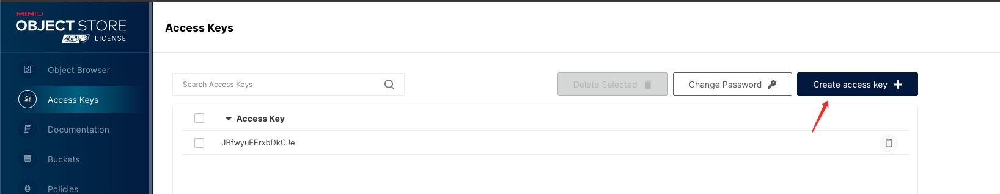
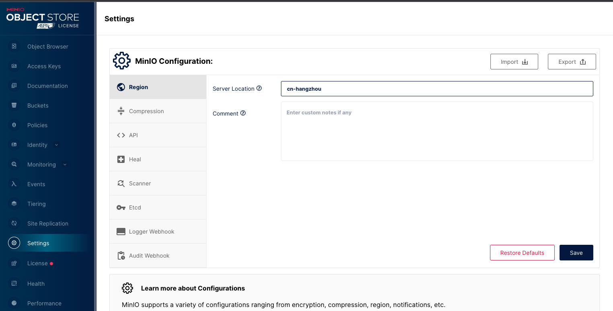

# 文件存储 S3

在 Fireboom 的最佳实践中，文件存储、读取、转换等工作应该全部交由 S3 来处理，Fireboom 支持所有兼容 S3 协议的服务，在使用前你需要先准备 S3 服务的配置，下面是常见的 S3 服务商的配置获取方法。

### 阿里云

进入阿里云官网[https://www.aliyun.com/](https://www.aliyun.com/)，登录成功后，打开控制台页面，在控制台页面-产品管理页，搜索对象存储，进入到对象存储页面

<figure><figcaption></figcaption></figure>

在存储桶列表页，进行创建存储桶操作

<figure><figcaption></figcaption></figure>

存储桶创建完成后，可在Bucket列表中点击对应的Bucket名称，即可获取存储桶名称、地域、地域节点信息

<figure><figcaption></figcaption></figure>

<figure><figcaption></figcaption></figure>

&#x20;

点击AccessKey管理，即可获取AccessKey ID和AccessKey Secret

<figure><figcaption></figcaption></figure>

<figure><figcaption></figcaption></figure>

在飞布文件存储模块，进行新增文件存储操作，将阿里云中获取的信息填写至对应的输入框中，保存完成即可

<figure><figcaption></figcaption></figure>

### 腾讯云

进入腾讯云官网[https://cloud.tencent.com/](https://cloud.tencent.com/)，登录成功后，打开控制台页面，在控制台页面-产品管理页，搜索对象存储，进入到对象存储页面

<figure><figcaption></figcaption></figure>

在存储桶列表页，进行创建存储桶操作

<figure><figcaption></figcaption></figure>

存储桶创建完成后，可在存储桶列表中点击对应的配置管理按钮，即可获取存储桶名称、所属地域、访问域名信息

<figure><figcaption></figcaption></figure>

<figure><figcaption></figcaption></figure>

&#x20;

点击秘钥管理-访问秘钥，即可获取SecretId和SecretKey

<figure><figcaption></figcaption></figure>

<figure><figcaption></figcaption></figure>

在飞布文件存储模块，进行新增文件存储操作，将腾讯云中获取的信息填写至对应的输入框中，保存完成即可

<figure><figcaption></figcaption></figure>

### AWS

进入亚马逊官网https://console.aws.amazon.com，登录成功后，打开控制台页面，搜索s3，进入到存储桶页面，进行创建存储桶操作

&#x20;

<figure><figcaption></figcaption></figure>

<figure><figcaption></figcaption></figure>

存储桶创建完成后，可在存储桶列表中点击对应的存储桶名称，即可获取存储桶名称、AWS区域信息

<figure><figcaption></figcaption></figure>

<figure><figcaption></figcaption></figure>

&#x20;

点击Security credentials入口，进行创建访问密钥操作

<figure><figcaption></figcaption></figure>

<figure><figcaption></figcaption></figure>

密钥创建成功后，获取访问密钥和秘密访问密钥

在飞布文件存储模块，进行新增文件存储操作，使用服务地址：s3.amazonaws.com以及获取的存储桶名称、AWS区域信息、访问密钥、秘密访问密钥进行创建，保存成功即可

<figure><figcaption></figcaption></figure>

### 自部署 minio

参考官方文档[https://min.io/download](https://min.io/download)完成安装，打开控制台页面，点击`Access Keys`，点击`Create access key`，创建一条新的认证配置信息，复制并粘贴到 Fireboom 中。&#x20;

<figure><figcaption></figcaption></figure>

<figure><figcaption></figcaption></figure>

服务地址一般为 `http://[minio-server].ip:9000` 区域在 minio 控制台，点击`Settings`，在默认`Region`面板右侧的`Server location`中填写并复制到 Fireboom中&#x20;

&#x20;

<figure><figcaption></figcaption></figure>

桶名称在 minio 控制台， 点击`Buckets`，点击`Create bucket`，根据提示完成创建&#x20;

<figure><figcaption></figcaption></figure>

