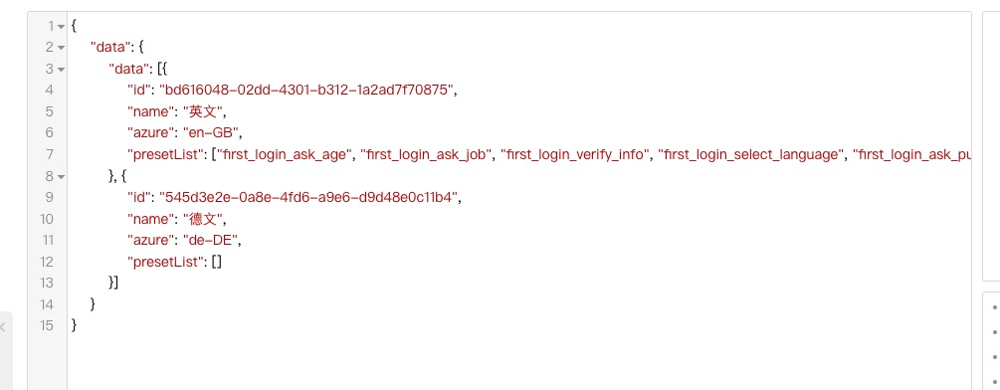

# API指令

飞布底层基于GraphQL协议构建，因此能充分发挥其指令系统的优势，扩展功能。

接下来，让我们分别介绍飞布支持的GraphQL指令。

GraphQL指令分为三类：全局指令、入参指令、字段指令。

## 全局指令

### 角色

飞布通过自定义GraphQL指令：`@rbac`，实现了API接口的RBAC控制。


```graphql
query GetOnetodo($uid: Int!) @rbac(requireMatchAll: [admin]) # 拥有admin角色用户才能访问 {
  data: todo_findFirsttodo(where: {user_id: {equals: $uid}}) {
    id
    title
    user_id
  }
}
```


详情见 [授权与访问控制](../yan-zheng-he-shou-quan/shou-quan-yu-fang-wen-kong-zhi/)。

### 内部

飞布通过自定义GraphQL指令：`@internalOperation`，设置OPERATION为内部方法。设置后不对外暴露，仅能用于钩子服务调用。可在右侧概览面板看到对应[流程图](ke-shi-hua-kai-fa.md#nei-bu-tiao-yong-liu-cheng-tu)的变化。

```graphql
query GetOneTodo($id: Int!) @internalOperation {
  data: todo_findFirstTodo(where: {id: {equals: $id}}) {
    id
    title
  }
}
```

`@internalOperation`仅能修饰QUERY 和 MUTATION OPERATION 。

详情见 [钩子](../../jin-jie-gou-zi-ji-zhi/gou-zi-ji-zhi.md)。

## 入参指令

入参指令指的是修饰OPERATION参数的GraphQL指令。它主要包含两类：修饰参数和注入参数。

### 修饰参数-jsonSchema

飞布通过自定义GraphQL指令：`@jsonSchema`，实现了API入参校验。

```graphql
query GetOnetodo($uid: Int! @jsonSchema(pattern: "^ [0-9]*$")# 正则表达式校验入参 ) {
  data: todo_findFirsttodo(where: {user_id: {equals: $uid}}) {
    id
    title
    user_id
  }
}
```

入参校验指令支持正则表达式，可实现常用的入参合法性校验。


09功能介绍-飞布如何实现API入参校验？


主要包含如下校验方式：

* 正则校验：正则表达式校验参数，用法`@jsonSchema(pattern: "这里是正则表达式")`
* 通用校验：使用内置的规则校验入参，包含EMAIL和DOMAIN，用法`@jsonSchema(`commonPattern`:` EMAIL`)`
* 长度校验：针对字符串，校验其长度`minLength`和`maxLength`
* 大小校验：针对数字，校验其大小`minimum`和`maximum`
* 数组校验：针对数组，校验数组的尺寸`minItems`和`maxItems`

### 注入参数

注入参数由服务端注入，不允许客户端修改，以保证数据安全。


07功能介绍-飞布如何设置UpdateAt为当前时间？


#### **fromClaim**

飞布通过自定义GraphQL指令：`@fromClaim`，结合OIDC协议，实现了API数据权限控制。


```graphql
query GetOnetodo($uid: Int! @fromClaim(name: USERID) # 注入当前登录用户的ID) {
  data: todo_findFirsttodo(where: {user_id: {equals: $uid}}) {
    id
    title
    user_id
  }
}
```


当访问用`@fromClaim`指令修饰的接口时，引擎从当前登录用户会话的Claims中获取用户的基本信息，例如邮箱、UID等，并注入到OPERATION的入参中，保证本次请求只能获取或操作登录用户拥有的数据，从而实现数据权限控制。可注入字段具体包含USERID、EMAIL、EMAIL\_VERIFIED、NAME、 NICKNAME、 LOCATION、 PROVIDER。


08功能介绍-飞布如何限制API数据权限?


#### **injectGeneratedUUID**

注入参数，服务端自动注入UUID，仅能修饰`string`字段。

```graphql
query myQuery ($uuid: String! @injectGeneratedUUID) {}
```

#### **injectCurrentDatetime**

注入参数，服务端自动注入Datetime，仅能修饰`date`字段。包含两种使用方式：

* 内置格式：系统内置了多种日期规范，包括：

```graphql
query myQuery ($updatedAt: DateTime! @injectCurrentDateTime(format: ISO8601)) {}
```

```
# 其他格式枚举
  ISO8601：2006-01-02T15:04:05-0700
  ANSIC：Mon Jan _2 15:04:05 2006
  UnixDate：Mon Jan _2 15:04:05 MST 2006
  RubyDate：Mon Jan 02 15:04:05 -0700 2006
  RFC822：02 Jan 06 15:04 MST
  RFC822Z：02 Jan 06 15:04 -0700
  RFC850：Monday, 02-Jan-06 15:04:05 MST
  RFC1123：Mon, 02 Jan 2006 15:04:05 MST
  RFC1123Z：Mon, 02 Jan 2006 15:04:05 -0700
  RFC3339：2006-01-02T15:04:05Z07:00
  RFC3339Nano：2006-01-02T15:04:05.999999999Z07:00
  Kitchen：3:04PM
  Stamp：Jan _2 15:04:05
  StampMilli：Jan _2 15:04:05.000
  StampMicro：Jan _2 15:04:05.000000
  StampNano：Jan _2 15:04:05.000000000
```

* 自定义格式：采用符合golang规范的日期自定义格式，用法

```graphql
query myQuery ($updatedAt: DateTime! @injectCurrentDateTime(customFormat: "符合golang规范的日期")) {}
```


不同数据库的datetime支持的格式不一样，可根据报错提醒，确定当前数据库支持的日期格式。


#### **injectEnvironmentVariable**

注入参数，服务端自动注入环境变量。环境变量可前往 设置-> 环境变量 进行配置。

```graphql
query myQuery ($applicationID: String! @injectEnvironmentVariable(name: "AUTH_APP_ID")) {}
```

#### **hooksVariable**

注入参数，设置后，允许在钩子中注入该参数，详情见钩子。

#### **internal**

特殊修饰符，与`_join`联合使用，实现跨源关联，详情见[跨源关联](kua-yuan-guan-lian.md)。

## 字段指令

### 响应转换

某些场景下，API所需的结构与数据库对应字段的层级不一致，因此要进行映射。飞布通过自定义GraphQL指令：`@transform`，实现了API 响应转换。


10功能介绍-飞布如何实现响应转换？


```graphql
query GettodoList {
  total: todo_aggregatetodo @transform(get: "_count.id") # 将_count.id值赋值给total字段 {
    _count {
      id
    }
  }
}
```

```json
# 转换前返回结果
{
    "total":{
        "_count":{
            "id":10
        }
    }
}
# 转换后返回结果
{
    "total":10
}
```

本质上是提取json结构的某个嵌套字段，然后赋值给上级字段。

此外，transfrom指令目前已支持直接将对象数组中的某个字段提取为普通数组。

在下方示例中，`presetList`字段原先的返回值类型是对象数组，通过`@transform(get: "[].I18n.Preset.code")`指令将`I18nItem`对象中的`I18n.Preset.code`提取为普通数组。

```graphql
query GetManyLearningLanguage {
  data: freetalk_findManyLearningLanguage(orderBy: {sort: desc}) {
    id
    name
    azure
    presetList: I18nItem @transform(get: "[].I18n.Preset.code")
   #将I18n.Preset.code值转换为普通数组并赋值给presetList字段 
   {
      I18n {
        Preset {
          code
        }
      }
    }
  }
} 
```

<figure><figcaption><p>对象数组转换前返回的结果</p></figcaption></figure>

<figure><figcaption><p>对象数组转换后返回的结果</p></figcaption></figure>
