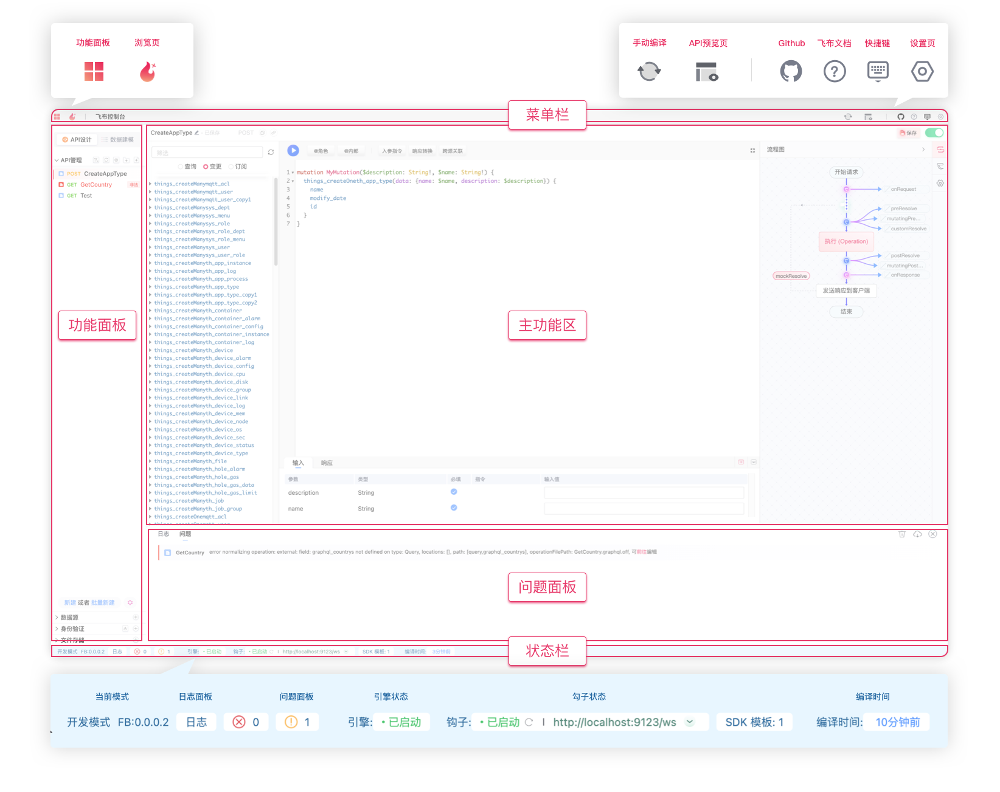
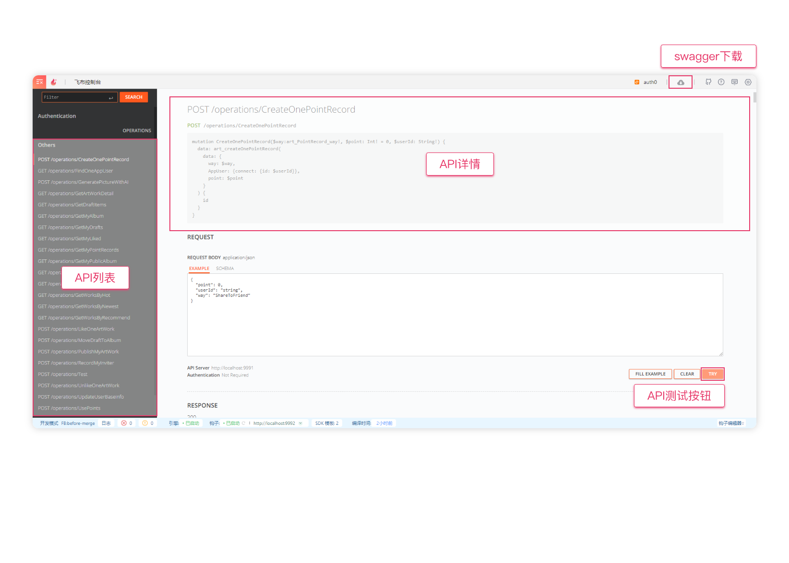

# 控制台

设置设置为了提供极致开发体验，飞布提供了友好的交互界面。本文重点介绍飞布的功能界面。

## 核心界面

<figure><figcaption>
主框架炸开图
</figcaption></figure>

上图是飞布的核心界面。它主要包含如下功能区：

* 菜单栏：包含各种菜单和选项，以帮助您进行各种操作。
* 功能面板：
  * API设计：API设计相关的功能，包括[API管理](../../api-gou-jian/)、数据源、身份验证和文件存储
  * 数据建模：数据库相关操作，简化版Navicat，包含[数据预览](../../shu-ju-yuan/shu-ju-ku/shu-ju-yu-lan.md)和[数据建模](../../shu-ju-yuan/shu-ju-ku/shu-ju-jian-mo.md)功能
* 主功能区：根据功能面板的具体功能，展示对应的操作界面。
* 日志面板：
  * 日志：展示编译后的所有日志，帮助定位问题
  * 问题：以结构化的方式展示具体问题，可直接定位问题点，如OPERATION不合法、数据库无法连接等
* 状态栏：展示当前系统的运行状态

## 概览页

概览页包含：数据统计和通知。

<figure><figcaption>
概览页
</figcaption></figure>

* 数据统计：统计功能面板各功能的数量，包含数据源、对外API、文件存储、身份验证
* 通知：展示飞布发布的最新公告信息，点击更多可跳转至官方论坛
* 指引：点击可以唤起新手引导功能。

## 预览页

预览页主要用来预览生成的API，它本质上是swagger文档的可视化展示。

<figure><figcaption>
API预览页
</figcaption></figure>

* API列表：以分组的形式展示API列表，主要包含operation编译的API和文件上传的API
* API详情：选中API后，展示详情，包括operation、入参模型、响应模型
* API测试：无需使用POSTMAN，输入入参，即可测试API
* 授权登录：选择对应身份认证器，跳转登录后，可使用当前身份访问接口
* swagger下载：可直接下载swagger文档，供第三方工具使用

详情前往 [#api-yu-lan](../../api-gou-jian/shi-yong-api.md#api-yu-lan "mention")

## 设置页

设置页用来进行系统设置。

<figure><figcaption>
设置页
</figcaption></figure>

* 外观：设置语言，当前支持中文和英文
* 系统：
  * API域名：对外暴露API时的服务域名，控制台中有两个地方会用到：
    * API预览页
    * 复制API访问地址按钮
  * [监听HOST](../../../shi-yong-bu-shu-shang-xian/security/#jian-ting-di-zhi)：核心引擎启动时监听的HOST
    * localhost：默认值，仅能本机访问，用[nginx代理](../../../shi-yong-bu-shu-shang-xian/bu-shu-yun-wei/shou-dong-bu-shu/#nginx-pei-zhi)后可外网访问
    * 0.0.0.0：所有IP都能访问，不安全，有两个常见用例
      * 不使用nginx代理，通过公网IP访问时
      * 在docker中启动时（在docker容器中，ip会被分到127.0.0.1）
  * 监听端口：核心引擎启动时监听的端口，用于暴露API，默认9991
  * 日志水平：核心引擎输出的日志水平
  * 调试：核心引擎是否开启调试
* 安全：
  * 允许主机：允许访问核心引擎的主机地址，默认允许全部，否则需要配置白名单
  * 重定向URL：详情见 [#oidc-pei-zhi](../../shen-fen-yan-zheng/shou-quan-ma-mo-shi/#oidc-pei-zhi "mention")
* 跨域：详情见 [kua-yu-fang-wen.md](../../../shi-yong-bu-shu-shang-xian/security/kua-yu-fang-wen.md "mention")
* 环境变量：环境变量的增删改查，用于保证私密数据的安全，详情见&#x20;
  * 可手动添加变量
  * 环境变量也可以在钩子服务中直接引用
* 版本：展示系统版本和依赖库的版本信息
