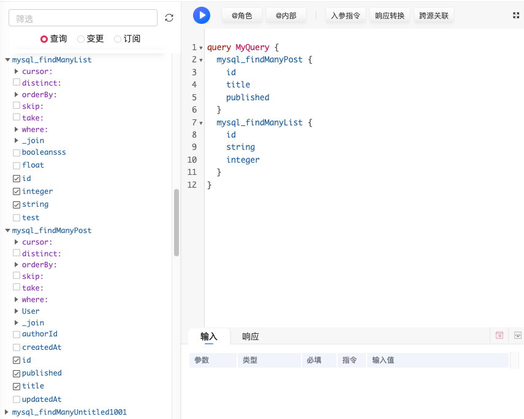
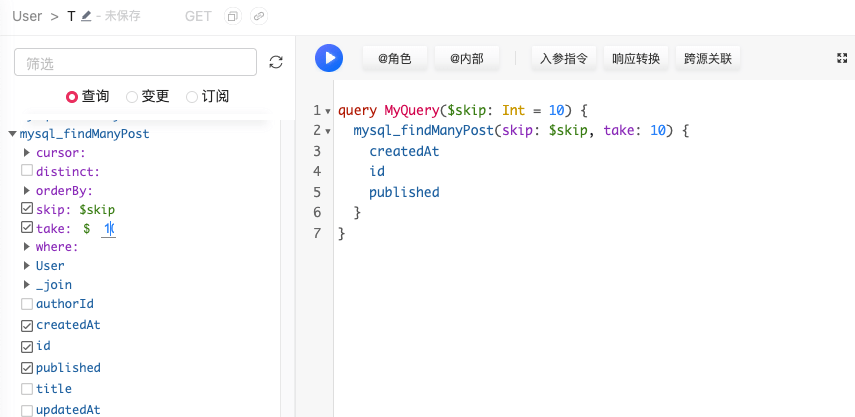
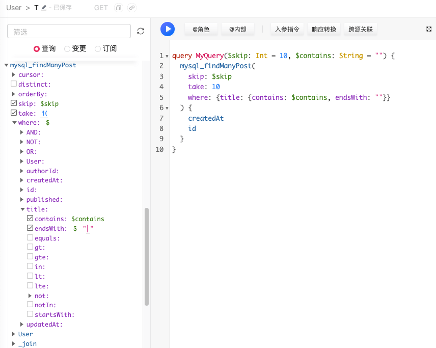

# 常见用例

组装查询
在超图中，可以依次点击多个查询函数，被选择查询会合并成一条 Query 语句，在查询结果中一次性返回

### 分页
1. 点击需要的分页查询，插入查询语句
2. 点击 skip 和 take，会自动在代码中插入 skip 和 take 语句
3. 点击超图中的$符号，自动插入对应的url参数，如图所示，skip参数已经插入，take参数还未插入
4. 点击查询下方的返回值，选择需要返回的字段

### 模糊搜索
1. 点击需要的分页查询，插入查询语句
2. 点击where展开查询字段
3. 点击需要查询的字段，如果需要做多条件查询，可以点击 [AND / OR / NOT]进一步展开
4. 点击想要的查询方式，然后点击$符号插入查询变量，如图中已插入contains变量

### 关联查询
1. 点击需要的分页查询，插入查询语句
2. 在选择字段时，以大写开头的是关联对象，可以点击展开后选择其中的字段，如果有多层关联，可以依次点击下去

### 跨源关联
通过 @export 和 _join 可以进行跨数据源的关联查询

