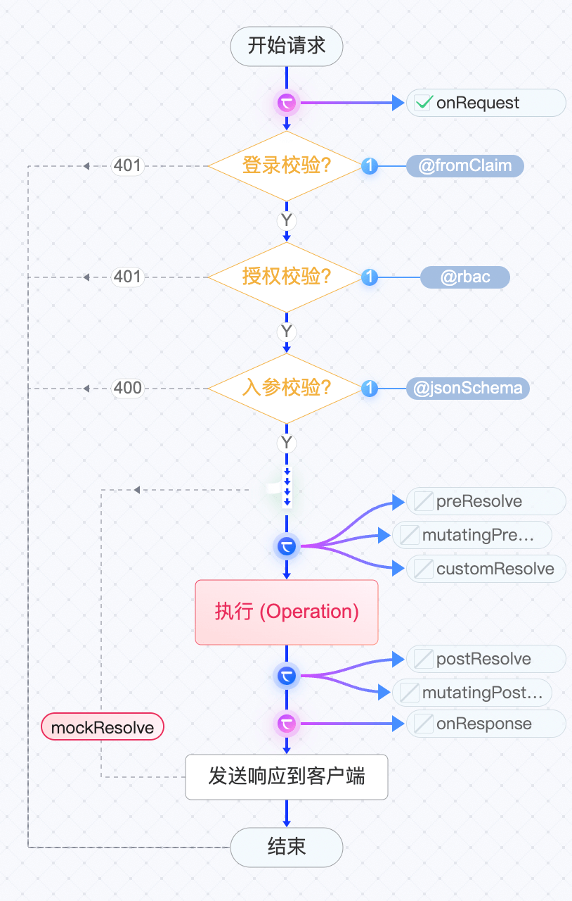

# 钩子规范

钩子服务本质上是一个实现了飞布钩子规范的WEB服务，可以用任意后端语言实现。

如果你希望实现其他语言的 hook SDK，需要遵从如下协议。

根据用途划分，钩子可分为4大类：局部钩子、全局钩子、授权钩子、文件钩子。

### 局部钩子（OPERATION钩子）

局部钩子目的是扩展OPEARTION的能力，分别在“OPEARTION执行”前后执行，主要用途是参数校验和副作用触发，如创建文章后发送邮件通知审核。

详情见如下流程图。



前置钩子在 "执行OPERATION"前执行，可修改校验或修改输入参数。



```go
func PreResolve(hook *base.HookRequest, body generated.Todo__CreateOneTodoBody) (res generated.Todo__CreateOneTodoBody, err error) {
    if body.Input.Title == "" {
	return nil, errors.New("标题不能为空")
    }
    return body, nil
}
```



```go
func MutatingPreResolve(hook *base.HookRequest, body generated.Todo__CreateOneTodoBody) (res generated.Todo__CreateOneTodoBody, err error) {
    if body.Input.Title == "" {
	body.Input.Title = "默认标题"
    }
    return body, nil
}
```



其中mutating开头的钩子可以修改 request 入参。

后置钩子在 "执行OPERATION" 后执行，可触发副作用（发邮件）或修改响应参数。



```go
func PostResolve(hook *base.HookRequest, body generated.Todo__CreateOneTodoBody) (res generated.Todo__CreateOneTodoBody, err error) {
    fmt.Println("我要发一封邮件xxx,标题是：", body.Input.Title, data)
    return body, nil
}
```



```go
func MutatingPostResolve(hook *base.HookRequest, body generated.Todo__CreateOneTodoBody) (res generated.Todo__CreateOneTodoBody, err error) {
    body.Response.Data.Data.UpdateAt = time.Now()
    return body, nil
}
```



其中mutating开头的钩子可以修改 response 结果。

除了上述局部钩子，还有两个特殊的局部钩子：自定义处理钩子和模拟钩子。

自定义处理钩子（customResolve）：

如果该钩子有返回值，那么将跳过“执行OPERATION”，直接返回当前钩子的返回值 ，否则继续执行后续流程。使用该钩子，可以修改默认 “执行OPERATION”的逻辑。

模拟钩子（mockResolve）：

用于返回模拟值，使用时会短路其余所有局部钩子。


| 路径                                             | 入参                                                                                                                             | 成功出参                                                                                                                              | 失败出参                                                      | 说明                                                    |
| ---------------------------------------------- | ------------------------------------------------------------------------------------------------------------------------------ | --------------------------------------------------------------------------------------------------------------------------------- | --------------------------------------------------------- | ----------------------------------------------------- |
| /operation/{operationName}/mockResolve         | <p>{ ctx: { user, internalClient: { quries, mutations } </p><p>}, input: req.body.input }</p>                                  | { op: operationName, hook: 'mock', response: ret, setClientRequestHeaders: request.ctx.clientRequest.headers }                    | { op: operationName, hook: 'mock', error }                | 模拟钩子，直接返回模拟数据而不经过其它流程                                 |
| /operation/{operationName}/preResolve          | <p>{ ctx: { user, internalClient: { quries, mutations } </p><p>}, input: req.body.input }</p>                                  | { op: operationName, hook: 'preResolve', setClientRequestHeaders: request.ctx.clientRequest.headers }                             | { op: operationName, hook: 'preResolve', error }          | 前置钩子，operation 处理前执行                                  |
| /operation/{operationName}/postResolve         | <p>{ ctx: { user, internalClient: { quries, mutations } </p><p>}, input: req.body.input, response: request.body.response }</p> | { op: operationName, hook: 'postResolve', setClientRequestHeaders: request.ctx.clientRequest.headers }                            | { op: operationName, hook: 'postResolve', error }         | 后置钩子，operation 处理后执行                                  |
| /operation/{operationName}/mutatingPreResolve  | <p>{ ctx: { user, internalClient: { quries, mutations } </p><p>}, input: req.body.input }</p>                                  | { op: operationName, hook: 'mutatingPreResolve', input: ret, setClientRequestHeaders: request.ctx.clientRequest.headers }         | { op: operationName, hook: 'mutatingPreResolve', error }  | 前置可修改钩子，可以修改 request 入参                               |
| /operation/{operationName}/mutatingPostResolve | <p>{ ctx: { user, internalClient: { quries, mutations } </p><p>}, input: req.body.input, response: request.body.response }</p> | { op: operationName, hook: 'mutatingPostResolve', response: ret, setClientRequestHeaders: request.ctx.clientRequest.headers }     | { op: operationName, hook: 'mutatingPostResolve', error } | 后置可修改钩子，可以修改返回的response                               |
| /operation/{operationName}/customResolve       | <p>{ ctx: { user, internalClient: { quries, mutations } </p><p>}, input: req.body.input }</p>                                  | { op: operationName, hook: 'customResolve', response: ret \|\| null, setClientRequestHeaders: request.ctx.clientRequest.headers } | { op: operationName, hook: 'customResolve', error }       | 自定义处理钩子，如果该钩子有返回值，那么将跳过后续的流程，直接返回 response，否则继续执行后续流程 |

其中`{operationName}`为`api.operations`遍历时的`operation.name`

### 全局钩子（数据源钩子）


| 路径                                     | 入参 | 成功出参 | 失败出参 | 说明                                                                         |
| -------------------------------------- | -- | ---- | ---- | -------------------------------------------------------------------------- |
| /global/httpTransport/onOriginRequest  | -  | -    | -    | 全局钩子 - 前置拦截                                                                |
| /global/httpTransport/onOriginResponse | -  | -    | -    | 全局钩子 - 后置拦截                                                                |
| /global/wsTransport/onConnectionInit   | -  | -    | -    | subscription 钩子， 需根据 `config.global?.wsTransport?.onConnectionInit` 判断是否开启 |

其中预执行钩子在最初请求，可以修改body和header（请使用OriginBody）

其中前置钩子在operation执行前，可以修改请求的body和header

其中后置钩子在operation执行后，可以修改响应的body和header



```go

func BeforeOriginRequest(hook *base.HttpTransportHookRequest, body *plugins.HttpTransportBody) (*base.ClientRequest, error) {
    return modifyForPayNotify(body)
}

func modifyForPayNotify(body *plugins.HttpTransportBody) (*base.ClientRequest, error) {
    u, err := url.Parse(body.Request.RequestURI)
    if err != nil {
	return nil, err
    }

    if u.Path != "/operations/Payment/PayNotify" {
	return body.Request, nil
    }

    // 1. 从body中取值
    modifyBody, err := sjson.Set("{}", "data", string(body.Request.OriginBody))
    if err != nil {
	return nil, err
    }

    // 2. 从url中取值
    for key, valArr := range u.Query() {
	modifyBody, _ = sjson.Set(modifyBody, key, valArr[0])
    }
    body.Request.Body = []byte(modifyBody)
    return body.Request, nil
}
```



```go

func OnOriginRequest(hook *base.HttpTransportHookRequest, body *plugins.HttpTransportBody) (*base.ClientRequest, error) {
    modifyBody := string(body.Request.Body)
    modifyBody, err := sjson.Set(modifyBody, "name", "admin")
    body.Request.Body = []byte(modifyBody)
    return body.Request, nil
}
```



```go
func OnOriginResponse(hook *base.HttpTransportHookRequest, body *plugins.HttpTransportBody) (*base.ClientResponse, error) {
   if hook.User == nil {
       body.Response.StatusCode = 401
   }
   
   return body.Response, nil
}
```



### 授权钩子


| 路径                                         | 入参  | 成功出参                                                                                           | 失败出参                                        | 说明                                                  |
| ------------------------------------------ | --- | ---------------------------------------------------------------------------------------------- | ------------------------------------------- | --------------------------------------------------- |
| /authentication/postAuthentication         | ctx | { hook: 'postAuthentication' }                                                                 | { hook: 'postAuthentication', error }       | OIDC流程用户登录成功后，执行该钩子，不可修改user对象，成功200，失败500，下同       |
| /authentication/mutatingPostAuthentication | ctx | { hook: 'postAuthentication', response: 函数返回值, setClientRequestHeaders: 参考flattenHeaders }     | { hook: 'postAuthentication', error }       | OIDC流程用户登录成功后，执行该钩子。主要用于修改登录对象user的值，实现特定逻辑，如绑定用户角色 |
| /authentication/revalidateAuthentication   | ctx | { hook: 'revalidateAuthentication', response: ret, setClientRequestHeaders: 参考flattenHeaders } | { hook: 'revalidateAuthentication', error } | 重校验钩子                                               |

其中postAuthentication钩子在认证后做自定义处理，比如同步用户信息等

其中mutatingPostAuthentication钩子在认证后修改用户信息

其中revalidateAuthentication钩子在operation执行前，可以修改请求的body和header



```go
func PostAuthentication(hook *base.AuthenticationHookRequest) error {
    return nil
}
```



```go
func MutatingPostAuthentication(hook *base.AuthenticationHookRequest) (*plugins.AuthenticationResponse, error) {
    return &plugins.AuthenticationResponse{User: hook.User, Status: "ok"}, nil
}
```



```go
func Revalidate(hook *base.AuthenticationHookRequest) (*plugins.AuthenticationResponse, error) {
    return nil, nil
}
```



### 文件钩子


### 数据代理

飞布服务不仅可以按照约定调用钩子服务，钩子也可以调用其它钩子，此时飞布服务变身为数据代理。


### NodeJs 上下文参考

```ts
req.ctx = {
  log: pino({
    level: PinoLogLevel.Debug
  }),
  user: req.body.__wg.user!,
  // clientRequest represents the original client request that was sent initially to the WunderNode.
  clientRequest: {
    headers: new Headers(req.body.__wg.clientRequest?.headers),
    requestURI: req.body.__wg.clientRequest?.requestURI || '',
    method: req.body.__wg.clientRequest?.method || 'GET',
  },
  internalClient: clientFactory({ 'x-request-id': req.id }, req.body.__wg.clientRequest),
}
```

### NodeJs 钩子参考

参考[ NodeJs 钩子](node-gou-zi.md)实现其它语言的钩子服务。
