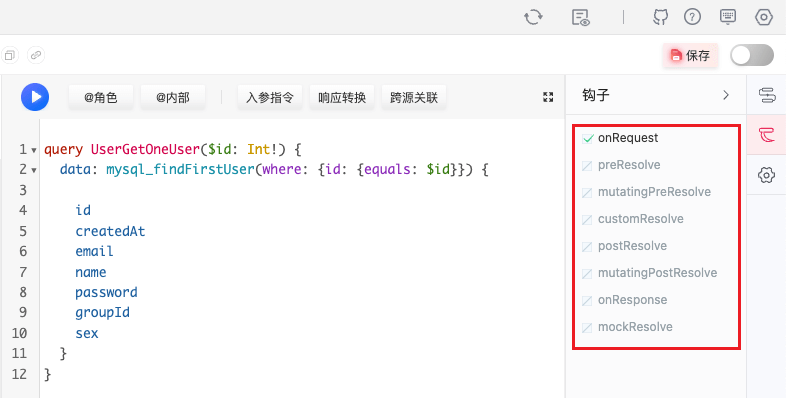
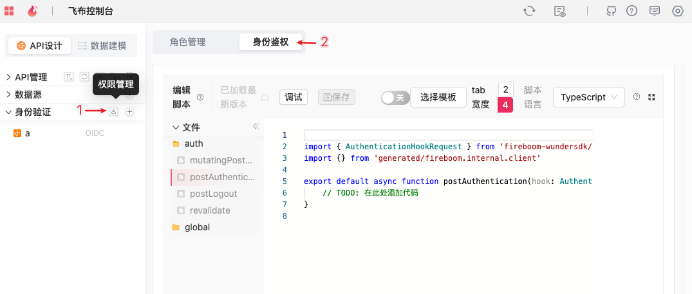
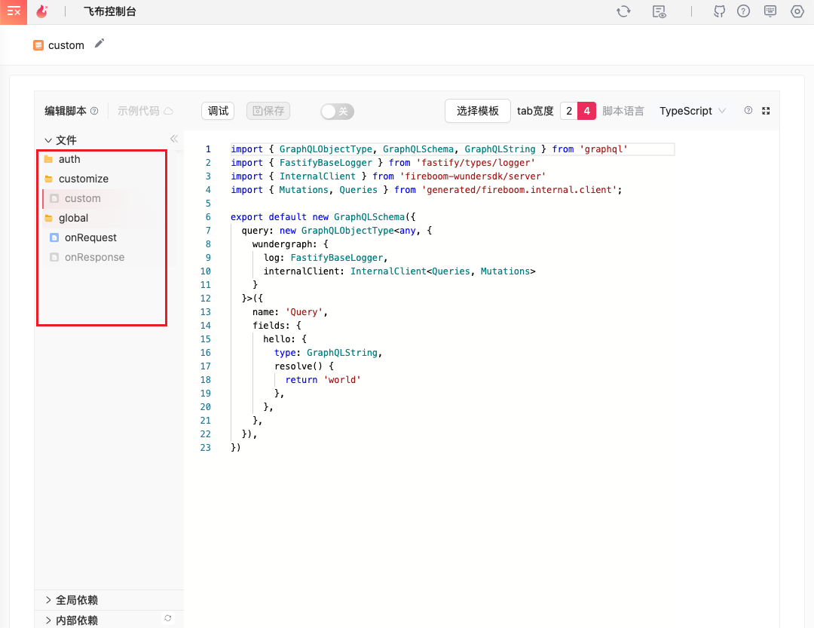
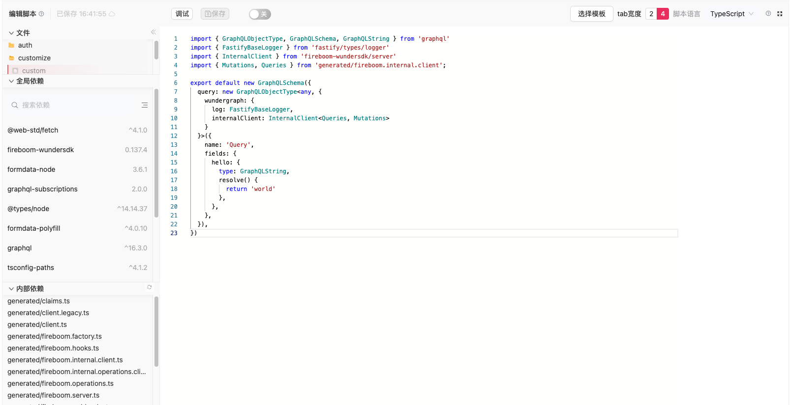
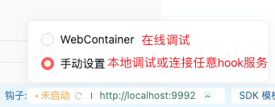
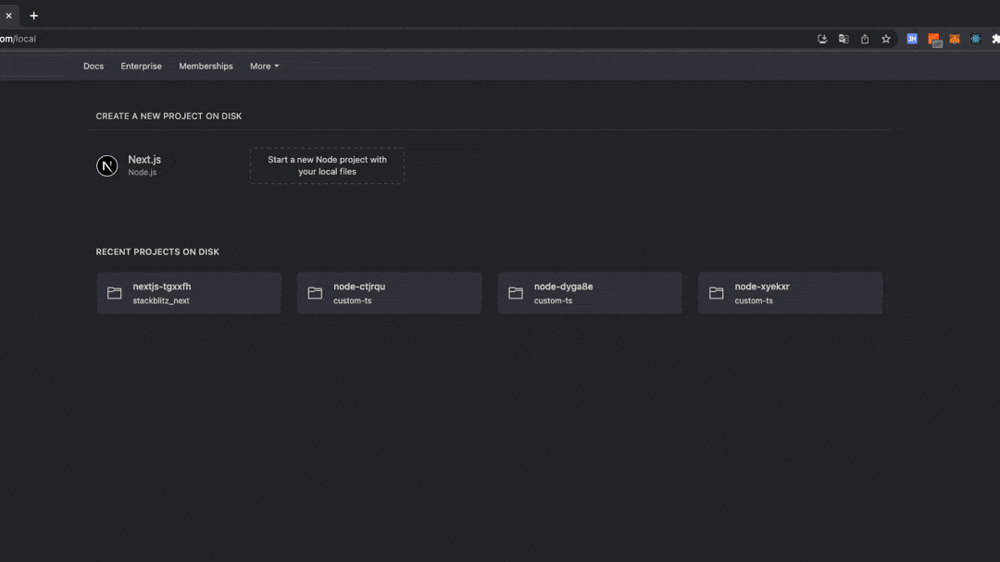

# Node钩子

本文将重点介绍，飞布内置的TS 钩子如何使用。

开发钩子的过程和开发web 服务是一样的，你都需要准备开发环境。若您本地没有NODE环境，可以使用飞布内置的webcontainer在线调试钩子。

node环境安装教程：[https://www.runoob.com/nodejs/nodejs-install-setup.html](https://www.runoob.com/nodejs/nodejs-install-setup.html)

## 快速操作

### 钩子编写

#### 在线编写

1.  找到对应的钩子

    * api 钩子 - 在 api 页面右侧流程图面板或钩子面板中点击需要编写的钩子、弹出钩子编辑器&#x20;

    

    * 身份验证器钩子 - 在左侧身份验证器面板上点击权限管理，然后在点击页面中的身份鉴权&#x20;

    

    * 自定义数据源钩子 - 直接在对应自数据源编辑页即可编写钩子
    * 除上述方式以外，也可以在已经打开钩子编辑器的情况下，点击左侧面板中的钩子名称，即可切换钩子

    &#x20;
2. 创建钩子 - 打开未创建的钩子时，会在编辑器中自动带入空白钩子模板。 此时钩子并未实际创建，需要进行任意修改后，方可保存和打开钩子。
3. 全局依赖 - 左侧全局依赖面板中，可以搜索 npm 并加载 npm 包，加载完成后代码编辑器中会自动引入依赖库。
4. 内部依赖 - 左侧内部依赖面板中可以看到系统生成的内置依赖库，提供包括现有api的类型定义、内置函数等功能。 双击对应项目可以将其快速插入代码中
5. 编辑和保存 - 编辑完成后，可以点击保存按钮或者等几秒触发自动保存，然后在打开顶部开关即可启用钩子。

&#x20;

#### IDE编写

由于钩子服务本身是一个完整可启动的项目，因此在通过上一节创建钩子后，可以直接在本地找到 custom-ts 文件夹，使用任意 IDE 或编辑器打开钩子项目进行编辑。

### 钩子调试

钩子服务可以选择在 web container 中启动或者本地启动。点击页面最下方的钩子选项，可以切换钩子服务的启动方式。

如果是本地启动，可以配置钩子服务器地址，默认是localhost:9992，如果将钩子服务移动到其他地址，可以在钩子面板中修改。

&#x20;

#### 在线调试

点击钩子面板顶部的调试按钮，会自动打开 stackblitz，选择加载本地项目，然后选中 custom-ts 文件夹，会将整个钩子服务加载进 stackblitz，然后自动启动钩子服务。&#x20;

<figure><figcaption></figcaption></figure>

#### IDE 调试

在 IDE 中打开custom-ts文件夹执行以下脚本启动钩子服务器。也可以通过调试器启动，以实现断点调试功能。

```shell
npm install
npm run watch
```

## 函数签名

所以钩子函数都是一个async函数，入参是一个hook对象，包含以下参数中的全部或一部分。

* clientRequest: 客户端请求对象，包含请求头、请求体、请求参数等信息
* internalClient: 内部客户端，可以通过此客户端发起内部请求，或操作数据库等
* user: 用户信息
* input: 输入参数
* response: 响应对象
* log: 日志对象

### postAuthentication

用户身份验证后，会调用此函数，可以在此函数中进行用户信息存储或打印日志等操作。

#### 函数签名

```ts
({ clientRequest, internalRequest, user, log }) => Promise<void>
```

### mutatingPostAuthentication

用户身份验证后，会调用此函数，可以在此函数中手动控制用户身份验证结果，返回 ok 表示验证通过，deny 表示验证失败。 验证通过时，可以修改返回的user对象，如果不需要修改，则直接返回入参的user即可。

#### 函数签名

```ts
({ clientRequest, internalRequest, user, log }) => Promise<{status: 'ok', user} | {status: 'deny', message}>
```

### revalidate

重新验证用户身份，当用户身份信息或权限等变更时，可以触发此钩子，用于更新相关数据。返回内容同 mutatingPostAuthentication

#### 函数签名

```ts
({ clientRequest, internalRequest, user, log }) => Promise<void>
```

### postLogout

用户登出时触发，可以在此钩子中清理用户登录信息，如删除外部session等。

#### 函数签名

```ts
({ clientRequest, internalRequest, user, log }) => Promise<void>
```

### onRequest

请求到达时触发，可以在此钩子中对请求进行预处理，如修改请求头、请求体等。返回值为修改后的请求对象。

#### 函数签名

```ts
({ clientRequest, internalRequest, user, log, input }) => Promise<clientRequest>
```

### preResolve

该钩子在请求到达后，api执行前触发，此处不能修改请求信息，通常可以在此处做日志记录。

#### 函数签名

```ts
({ clientRequest, internalRequest, user, log, input }) => Promise<void>
```

### mutatingPreResolve

该钩子在请求到达后，api执行前触发，该接口可以修改请求入参。

#### 函数签名

```ts
({ clientRequest, internalRequest, user, log, input }) => Promise<input>
```

### postResolve

该钩子在api执行后触发，此处不能修改请求信息，通常可以在此处做日志记录，或触发其他额外操作。

#### 函数签名

```ts
({ clientRequest, internalRequest, user, log, input, response }) => Promise<void>
```

### mutatingPostResolve

该钩子在api执行后触发，该接口可以修改响应内容。

#### 函数签名

```ts
({ clientRequest, internalRequest, user, log, input, response }) => Promise<response>
```

### customResolve

该钩子在api执行前触发，你可以在该接口中覆盖 api 的执行逻辑。当该接口返回 void 或 null 时，将正常执行api，否则将跳过执行直接返回该接口的返回值。 您可以在该接口中实现自定义权限或其他数据校验逻辑，用以控制api的执行。

#### 函数签名

```ts
({ clientRequest, internalRequest, user, log, input }) => Promise<response>
```

### mockResolve

该钩子用于实现mock功能, 用于在开发阶段模拟api的返回结果，以便于前端开发人员进行开发。

#### 函数签名

```ts
({ clientRequest, internalRequest, user, log, input }) => Promise<response>
```

### NodeJs 上下文参考

```ts
req.ctx = {
  log: pino({
    level: PinoLogLevel.Debug
  }),
  user: req.body.__wg.user!,
  // clientRequest represents the original client request that was sent initially to the WunderNode.
  clientRequest: {
    headers: new Headers(req.body.__wg.clientRequest?.headers),
    requestURI: req.body.__wg.clientRequest?.requestURI || '',
    method: req.body.__wg.clientRequest?.method || 'GET',
  },
  internalClient: clientFactory({ 'x-request-id': req.id }, req.body.__wg.clientRequest),
}
```
