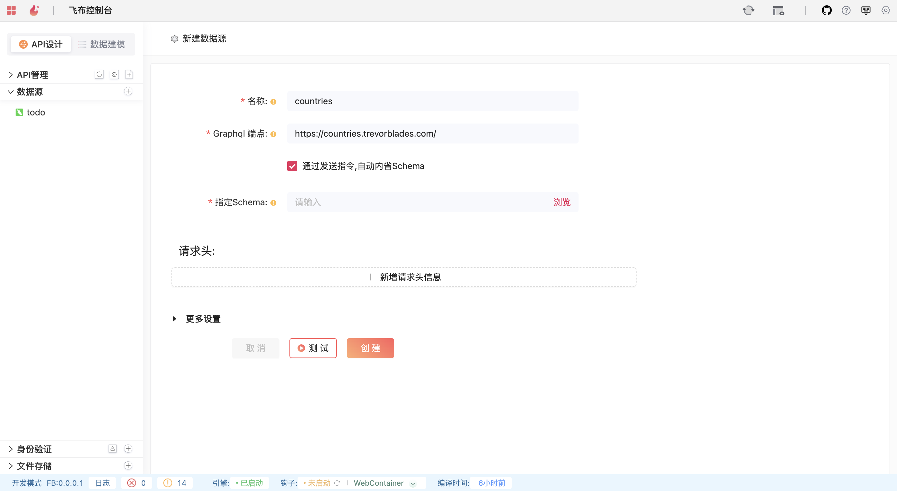

# GraphQL API

## 新建**GraphQL** API

**新建数据源** -> **GraphQL API**，设置参数，如名称、GraphQL端点。

<figure><figcaption>
<strong>GraphQL</strong>数据源
</figcaption></figure>

* 对于支持内省的GraphQL端点，飞布自动内省获得GraphQL Schema（子图），并以名称作为命名空间，合并到“超图”中。
* 对于不支持内省的GraphQL端点，需要勾选“复选框”，展开“指定Schema”选项，手动上传Schema文件

## 认证方式

参考 REST API [#ren-zheng-fang-shi](rest-api.md#ren-zheng-fang-shi "mention")。

\
