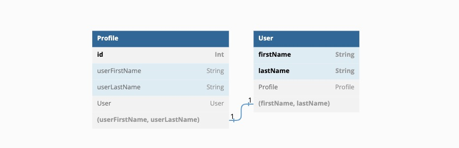
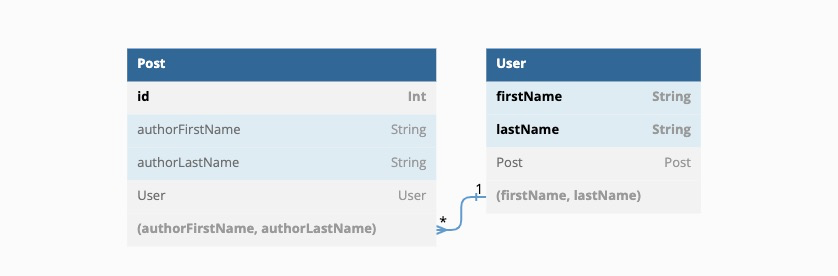
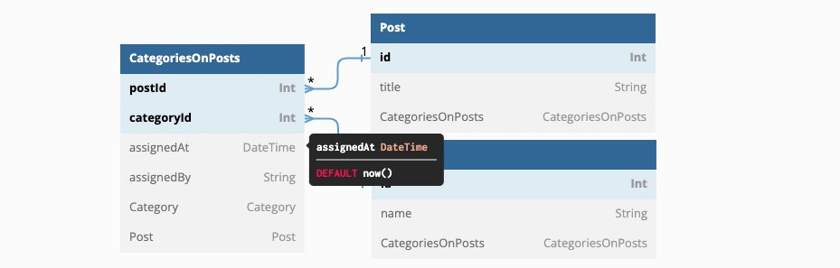

# 数据建模

数据建模用来进行数据库设计，具有完备的数据表设计能力，类似[Navicat](https://navicat.com.cn/products#navicat)数据库开发工具。它本质上是对Prisma Schema的可视化封装。

你也可以使用Navicat等数据库管理工具进行表结构设计。


01功能介绍 如何用飞布设计数据库？


## 控制台打开

<figure><figcaption><p>数据建模</p></figcaption></figure>

1，切换到“数据建模”页签

2，选择数据源，例如`todo`数据库

3，点击“ (2).png>)”切换到数据建模功能页

## 模型设计

数据建模支持两种模式：普通视图和源码视图，分别适用于新手开发者和熟悉Prisma的开发者。点击右上角的图标 (3).png>)和.png>)，可切换两种视图。

### 普通视图

#### 新增表

1. 点击数据建模右侧的“+”，双击输入表名
2. 点击右侧面板顶部的“+”，输入字段名称和类型
3. 点击字段行后的“?”，设置字段为数组或是否为空
4. 点击字段行后的“@”，为字段增加描述
5. 点击顶部的“@”，为表增加属性，前往[参考](https://www.prisma.io/docs/concepts/components/prisma-schema/data-model#defining-attributes)
6. 点击顶部的“迁移”按钮，保存修改

> 迁移本质上调用了 prisma db push 命令，该方式不可用于<mark style="color:orange;">生产环境</mark>，详情查看[prisma文档](https://www.prisma.io/docs/concepts/components/prisma-migrate/db-push)。
>
> 

#### 删除表

有两个方式可以删除表，一是选中表后，点击顶部的“删除”按钮，二是在左侧列表右击，点击“删除”。

### 源码视图

源码视图展示prisma schema源文件，同时支持语法提醒和高亮展示，你可以用它实现任意形式的数据建模。

<figure><figcaption><p>源码视图</p></figcaption></figure>

### ER图

#### 一对一的关系

一对一（1-1）关系是指最多一个记录可以在关系的两边连接。在下面的示例中，User和Profile：

```
model User {
  id      Int      @id @default(autoincrement())
  profile Profile?
}

model Profile {
  id     Int  @id @default(autoincrement())
  user   User @relation(fields: [userId], references: [id])
  userId Int  @unique // relation scalar field (used in the `@relation` attribute above)
}
```

在飞布中可以得到对应的ER图，如下：

<figure><figcaption><p>一对一的关系图</p></figcaption></figure>

在关系型数据库中可以定义多个字段的一对一关联：

```
model User {
  firstName String
  lastName  String
  profile   Profile?

@@id([firstName, lastName])
}

model Profile {
id            Int    @id @default(autoincrement())
user          User   @relation(fields: [userFirstName, userLastName], references: [firstName, lastName])
userFirstName String // relation scalar field (used in the `@relation` attribute above)
userLastName  String // relation scalar field (used in the `@relation` attribute above)

@@unique([userFirstName, userLastName])
}
```

在飞布中可以得到对应的ER图，如下：

<figure><figcaption><p>多字段一对一的关系图</p></figcaption></figure>

#### 一对多的关系

一对多（1-n）关系是指关系一侧的一个记录可以连接到另一侧的零或多个记录的关系。在以下示例中，User和Post模型之间有一个一对一的关系：

```
model User {
  id    Int    @id @default(autoincrement())
  posts Post[]
}

model Post {
  id       Int  @id @default(autoincrement())
  author   User @relation(fields: [authorId], references: [id])
  authorId Int
}
```

在飞布中可以得到对应的ER图，如下：

<figure><figcaption><p>一对多的关系图</p></figcaption></figure>

在关系型数据库中可以定义多个字段的一对多关联：

```
model User {
  firstName String
  lastName  String
  post      Post[]

  @@id([firstName, lastName])
}

model Post {
  id              Int    @id @default(autoincrement())
  author          User   @relation(fields: [authorFirstName, authorLastName], references: [firstName, lastName])
  authorFirstName String // relation scalar field (used in the `@relation` attribute above)
  authorLastName  String // relation scalar field (used in the `@relation` attribute above)
}
```

在飞布中可以得到对应的ER图，如下：

<figure><figcaption><p>多字段一对多的关系图</p></figcaption></figure>

#### 多对多的关系

多对多关系定义了三种模型：

1. 两个具有多对多关系的模型，如Category和Post
2. 一个表示关系表的模型，例如基础数据库中的 CategoriesOnPosts（有时也称为JOIN、链接或数据透视表）

在本例中，表示关系表的模型定义了描述Post/Category关系的其他字段-谁分配了类别（assignedBy），以及何时分配了类别（assignedAt）：

```
model Post {
  id         Int                 @id @default(autoincrement())
  title      String
  categories CategoriesOnPosts[]
}

model Category {
  id    Int                 @id @default(autoincrement())
  name  String
  posts CategoriesOnPosts[]
}

model CategoriesOnPosts {
  post       Post     @relation(fields: [postId], references: [id])
  postId     Int // relation scalar field (used in the `@relation` attribute above)
  category   Category @relation(fields: [categoryId], references: [id])
  categoryId Int // relation scalar field (used in the `@relation` attribute above)
  assignedAt DateTime @default(now())
  assignedBy String

  @@id([postId, categoryId])
}
```

在飞布中可以得到对应的ER图，如下：

<figure><figcaption><p>多对多的关系图</p></figcaption></figure>
