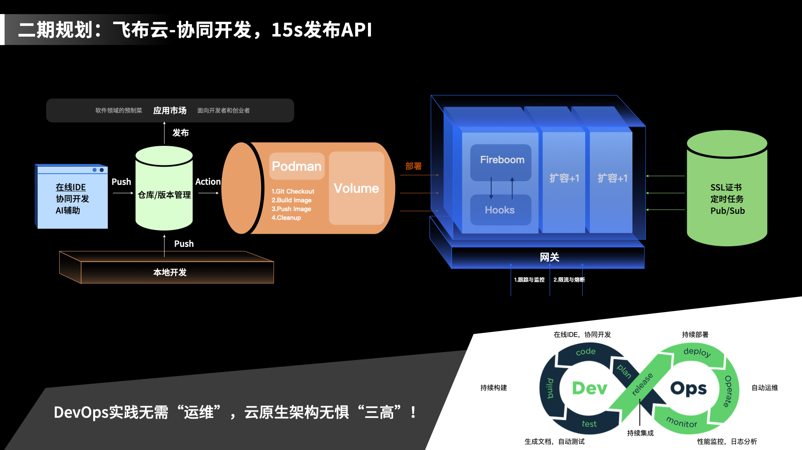

# 初识飞布

飞布整个产品体系是基于飞布IDE的开发者生态和云服务​，主要由三个产品组成：飞布控制台、飞布云、应用市场。我们常说的飞布，主要指飞布控制台。

## 飞布控制台（社区版）

飞布控制台是飞布产品矩阵的核心，它本质上是一个CLI工具，核心命令`fireboom dev，`启动后包含一个web控制面板，提供友好的交互页面。

基于控制台，开发者可通过勾选或配置，实现大部分API的开发工作。API开发完毕后，默认通过`9991`端口暴露。可自行制定对应端口。

飞布控制台支持私有化部署，开发者无需担心供应商锁定。

## 团队版

支持团队协作。该功能暂未实现，详情见[lu-xian-tu.md](../lu-xian-tu.md "mention")

## 飞布云

<figure><figcaption>
飞布云协同开发示意图
</figcaption></figure>

飞布云能够帮开发者在几秒内创建高度优化以及可大规模扩展的飞布实例，并包括额外的可靠性、监控、缓存、跟踪、安全和部署特性。当然，开发者也可以使用飞布社区版手动部署飞布。

当前飞布云仍在规划中，详情见[lu-xian-tu.md](../lu-xian-tu.md "mention")

## 应用商城

飞布应用商城是基于飞布的应用分发平台，但不同于app store，用户使用应用并订阅的模式。应用商城以源码销售的方式分发应用。应用商城主要服务两类用户：创业者和开发者。创业者从应用商城中选购应用，并基于飞布云快速部署应用，服务自身业务。开发者一方面可以用应用市场选购应用，进行二次开发满足客户需求；另一方面，开发者可以基于飞布开发的应用上架的应用市场，进行二次销售，实现盈利。
