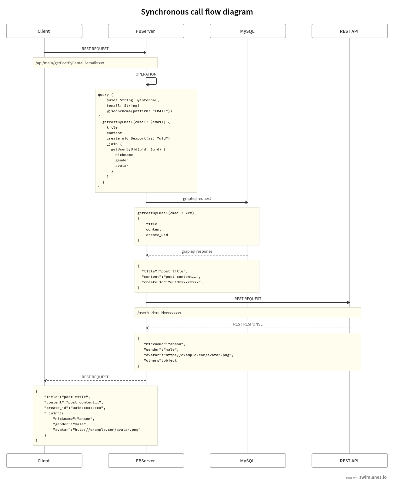
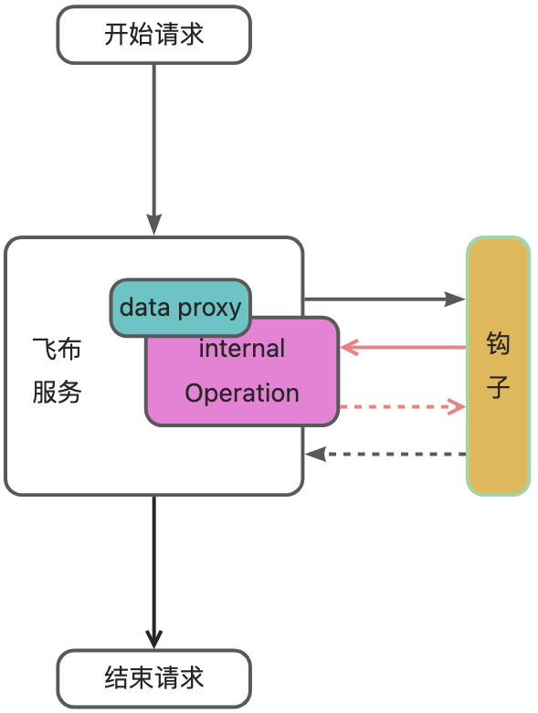

# 工作原理

本文主要介绍飞布的底层工作原理，帮你建立关于飞布底层工作机制的宏观印象。

对于B/S架构，WebAPI本质上是服务端和客户端进行数据交互的接口。服务端连接不同类型数据源，从中获取并处理数据，按照客户端需求拼接并返回字段。通常情况下，实现该过程需要后端开发者编写大量代码。但绝大多数WebAPI都是针对数据库表及其关联表的增删改查，还有一小部分只需要在查询数据之前或之后，增加一些自定义逻辑。

## 聚合数据源——超图

因此，我们可以提取共性，用声明式语法描述数据表操作，并集成钩子机制扩展业务逻辑。其实，SQL也是一种声明式语法，适用于关系型数据库查询，不适合作为API声明式语法。GraphQL也是一种声明式语法，是一种基于图形的查询语言，用于从API中检索数据。总的来说，SQL适用于关系数据库，GraphQL适用于API查询。

所以，飞布选择GraphQL作为声明式语言，用来替代数据库的SQL语法。此外，GraphQL还能表达REST API的OAS规范。因此，选择GraphQL作为声明式语言，可以统一数据库和REST API，当然也能统一本身就是GraphQL的GraphQL API。

为了简化操作，飞布支持自动内省数据库、REST API以及GraphQL API，获得对应数据源的GraphQL Schema，我们称之为“子图”。

总的来说，飞布以 API 为中心，将所有数据抽象为 API，包括 REST API，GraphQL API ，数据库甚至消息队列等，通过 GraphQL 协议把他们聚合在一起，形成具有数据全集的“超图”。

<figure><figcaption><p>飞布架构图</p></figcaption></figure>

## 服务端OPERATION

理论上，基于“超图”公开对外发布GraphQL API，能够一劳永逸。因为，“超图”中包含了数据源中的任意数据。前端开发者只需要从GraphQL API中选择所需数据，构建子集OPERATION，就能够满足绝大多数业务需求，这也是hasura的实现方式。但该方式除了给前端开发者增加<mark style="color:red;">额外学习成本</mark>外，还有如下弊端：<mark style="color:red;">无法复用HTTP基础设施</mark>、<mark style="color:red;">安全性差</mark>（攻击者在客户端构造深度OPERATION发起DDOS攻击）。


OPERATION：GraphQL有三种类型的operation，分别为query（查询）, mutation（变更）以及 subscription（订阅）


飞布采用了一种新的实现形式：**服务端OPERATION**。相比于hasura对外暴露GraphQL API，然后让前端开发者编写OPERATION调用GraphQL端点的方式。飞布在生产环境下**不**对外暴露GraphQL API，而是让后端开发者在服务端编写OPERATION。然后，飞布引擎将OPERATION编译为 REST-API，暴露给前端开发者。该方式，不仅能避免客户端OPERATION的所有缺陷，而且能充分发挥GraphQL的优势。

此外，飞布不仅支持查询和变更，还支持将GraphQL Subscription转换为**实时消息**。

首先，前端开发者无需感知GraphQL的存在，因此<mark style="color:orange;">无需任何学习成本</mark>。

其次，飞布对外暴露REST API，可以<mark style="color:orange;">复用HTTP基础设施</mark>，如CDN等。

再者，OPERATION保存在服务端，攻击者无法触达OPERATION，保证了<mark style="color:orange;">安全</mark>。

最后，无论客户端还是服务端OPERATION，都能利用GraphQL<mark style="color:orange;">按需取用、类型系统</mark>的优势。

<figure><figcaption><p>数据流转图</p></figcaption></figure>

## 指令系统扩展能力

飞布采用服务端OPERATION架构还带来了额外的好处。利用GraphQL强大的指令系统，飞布可以通过指令注解的方式实现复杂业务逻辑，其中大部分逻辑都有安全性要求，因此不能用客户端OPERATION实现。


Directives 可视为GraphQL 的一种语法蜜糖(sugar syntax)，通常用于调整query 及schema 的行为，不同场景下可以有以下功能：

1. 影响query原有行为，如@include, @skip为query增加条件判断
2. 为Schema加上描述性标签，如@deprecated可以用于废除schema的某field又避免breaking change
3. 为Schema 添加新功能，例如参数检查、简单计算、权限检查、错误处理等等。


### API接口权限

控制接口只能被拥有特定权限的用户访问，是WEBAPI开发过程中，最基本的需求。业内最通用接口权限控制方式是：RBAC模型。飞布通过自定义GraphQL指令：`@rbac`，实现了API接口的RBAC控制。


```graphql
query GetOnetodo($uid: Int!) @rbac(requireMatchAll: [admin]) # 拥有admin角色用户才能访问 {
  data: todo_findFirsttodo(where: {user_id: {equals: $uid}}) {
    id
    title
    user_id
  }
}
```


<mark style="color:red;">当用户登录后</mark>，系统会主动调用授权钩子`mutatingPostAuthentication`，钩子入参中包含`use`r对象，开发者可自行编写业务代码，根据`user_id`或邮箱从对应用户角色数据源中获取当前用户角色，赋值给`user`对象。随后，登录用户调用接口时，系统判断当前用户拥有的角色是否匹配当前接口，匹配则放行，否则返回401未授权错误。

<figure><figcaption><p>RBAC指令原理</p></figcaption></figure>

### API数据权限

限制接口只能被登录用户访问，且只能获取当前用户所拥有的数据行或字段，也是WEBAPI开发的常见需求。飞布通过自定义GraphQL指令：`@fromClaim`，结合OIDC协议，实现了API数据权限控制。


```graphql
query GetOnetodo($uid: Int! @fromClaim(name: USERID) # 注入当前登录用户的ID) {
  data: todo_findFirsttodo(where: {user_id: {equals: $uid}}) {
    id
    title
    user_id
  }
}
```


当访问用`@fromClaim`指令修饰的接口时，引擎从当前登录用户会话的Claims中获取用户的基本信息，例如邮箱、UID等，并注入到OPERATION的入参中，保证本次请求只能获取或操作登录用户拥有的数据，从而实现数据权限控制。

<figure><figcaption><p>OIDC指令原理</p></figcaption></figure>

### API入参校验

接口入参校验也是WEBAPI开发过程中较繁琐的部分。飞布通过自定义GraphQL指令：`@jsonSchema`，实现了API入参校验。

```graphql
query GetOnetodo($uid: Int! @jsonSchema(pattern: "^ [0-9]*$")# 正则表达式校验入参 ) {
  data: todo_findFirsttodo(where: {user_id: {equals: $uid}}) {
    id
    title
    user_id
  }
}
```

入参校验指令支持正则表达式，可实现常用的入参合法性校验。

### API参数注入

很多场景下，接口的入参需要由服务端动态设置特定参数。飞布内置了如下指令，分别适用不同场景的需求。

* @injectGeneratedUUID：生成uuid注入到参数中
* @injectCurrentDateTime：获取当前时间，注入到参数中
* @injectEnvironmentVariable：获取环境变量，注入到参数中

```graphql
query GetOnetodo($uid: Int! @injectGeneratedUUID # 生成UUID) {
  data: todo_findFirsttodo(where: {user_id: {equals: $uid}}) {
    id
    title
    user_id
  }
}
```

### API响应转换

某些场景下，API所需的结构与数据库对应字段的层级不一致，因此要进行映射。飞布通过自定义GraphQL指令：`@transform`，实现了API入参校验。

```graphql
query GettodoList {
  total: todo_aggregatetodo @transform(get: "_count.id") # 将_count.id值赋值给total字段 {
    _count {
      id
    }
  }
}
```

```json
# 转换前返回结果
{
    "total":{
        "_count":{
            "id":10
        }
    }
}
# 转换后返回结果
{
    "total":10
}
```

本质上是提取json结构的某个嵌套字段，然后赋值给上级字段。

### 跨数据源关联

某些场景下，WEBAPI需要组合多个数据源的数据。利用GraphQL的组装特性，可以很方便实现多数据源的查询和变更操作，但无法实现多数据源间的流程控制，例如先从数据库获取设备列表，然后通过物联网API获取设备在线是否在线，组装后发送至客户端。

<figure><figcaption><p>同步调用时序图</p></figcaption></figure>

## OPERATION配置

除了指令，飞布还支持OPERATION配置，通过配置实现更多复杂业务。

### 数据缓存

飞布底层基于golang语言实现，实现了内存级别的数据缓存功能。你只需在API详情的设置中开启该功能即可使用。

### N+1查询

飞布基于Tank机制，解决了N+1查询问题，无需任何配置即可使用该能力。

### 服务端轮询

很多场景下，客户端需要实时更新数据。当前，主流方式是客户端轮询，即客户端每隔几秒请求一次接口，获取数据。当客户端数量较多时，会给服务端造成较大并发压力。飞布采用了一种新的机制：服务端轮询。它能以较小的代价，解决客户端轮询造成的资源消耗问题，实现数据的**准实时**更新。

<figure><figcaption><p>服务端轮询时序图</p></figcaption></figure>

服务端轮询把轮询逻辑从客户端移动到服务端，由服务端定时请求数据，并比对前后两次数据是否一致，若数据变化，则推送数据到客户端。同时，只有当客户端订阅准实时事件时，服务端才会定时轮询数据，保证系统性能。

任意OPERATION查询，经过简单配置，均可具备准实时推送能力。

## 钩子机制扩展逻辑

上述章节，我们基于GraphQL，用声明式架构解决了CURD接口生成的问题。但仍有部分接口，无法通过声明实现。因此，我们还要实现某种机制，支持自定义逻辑。

飞布提供了各种类型的钩子，包括API请求生命周期的钩子、授权生命周期的钩子、文件上传声明周期的钩子，用以解决上述问题。

飞布服务与钩子服务相互独立，服务间通过HTTP协议通讯，可分别部署。钩子服务本质上是一个实现了飞布钩子规范的WEB服务。因此，可以用任意后端开发语言实现钩子，真正做到多语言兼容。

不仅，飞布可以调用钩子，钩子也可以调用飞布。此时，飞布相对于钩子是一个数据代理服务，同时飞布的所有OPERATION都可以供钩子使用。在另一个角度上，钩子也可以认为是serverless架构。

<figure><figcaption><p>飞布钩子机制</p></figcaption></figure>

## 总结

飞布以 API 为中心，将所有数据抽象为 API，包括 REST API，GraphQL API ，数据库甚至消息队列等，通过 GraphQL 协议把他们聚合在一起，形成具有数据全集的“超图”。

飞布用可视化界面封装了GraphQL细节，允许开发者通过勾选从“超图”中构建子集 Operation（查询、变更和订阅） 作为函数签名，并将其编译为 REST-API。这即充分利用了GraphQL按需取用、类型系统的优势，又免除了它无法复用HTTP基础设施以及不安全的弊端。

飞布还充分利用了GraphQL的指令系统，通过指令注解实现了API权限和数据权限的控制，入参校验，以及跨数据源关联！但用户无需刻意学习，因为飞布提供了友好的交互，封装了这些技术细节。

飞布提供了开箱即用的API缓存、实时推送和实时查询功能。通过服务端轮询，可以实现任意数据源的实时查询！

最后，飞布基于 HTTP 协议实现了 HOOKS 机制，方便开发者采用任何喜欢的语言实现自定义逻辑。

##


