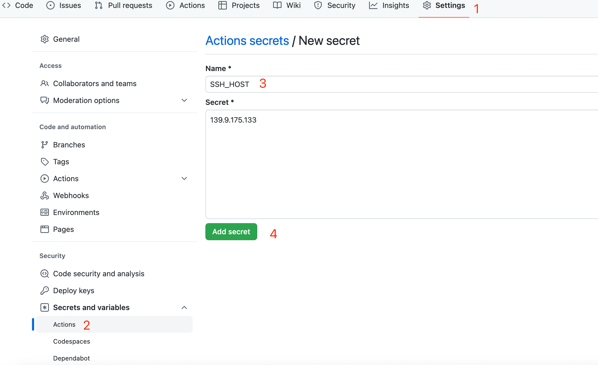

# 流水线部署

流水线自动部署的思路整体和手动部署相似，只需要将重启脚本提前准备好即可。下面以 Github Action 部署为例介绍使用。

我们仍然用 [Vue TodoMVC](https://github.com/fireboomio/case-vue-todomvc) 作为部署项目。首先我们需要在部署服务器上提前准备好环境

1. 安装 Nginx，新建项目部署位置 `/path/to/deploy`，添加一个 nginx conf 文件指向该目录，参考配置如下

```nginx
upstream backend {
  server 127.0.0.1:9991;
}

server {
    listen 80;
    server_name your.domain;
    rewrite ^(.*) https://$server_name$1 permanent;
}

# https 配置，没有则将后续配置剪切到上面的80服务里
server {
  listen       443 ssl;
  server_name  your.domain;
  charset utf-8;

  access_log /var/log/nginx/app.fb.todomvc.access.log;
  error_log /var/log/nginx/app.fb.todomvc.error.log;

  # https://github.com/darktable/html5-boilerplate-server-configs/blob/master/nginx.conf
  # Enable Gzip
  gzip  on;
  gzip_http_version 1.0;
  gzip_comp_level 2;
  gzip_min_length 1100;
  gzip_buffers     4 8k;
  gzip_proxied any;
  gzip_types
    # text/html is always compressed by HttpGzipModule
    text/css
    text/javascript
    text/xml
    text/plain
    text/x-component
    application/javascript
    application/json
    application/xml
    application/rss+xml
    font/truetype
    font/opentype
    application/vnd.ms-fontobject
    image/svg+xml;

  gzip_static on;

  gzip_proxied        expired no-cache no-store private auth;
  gzip_disable        "MSIE [1-6]\.";
  gzip_vary           on;

  # 根据实际情况修改
  ssl_certificate /etc/nginx/cert/1_app.fb.todomvc.crt;
  ssl_certificate_key /etc/nginx/cert/2_app.fb.todomvc.key;
  ssl_session_timeout 5m;
  ssl_protocols TLSv1 TLSv1.1 TLSv1.2;
  ssl_ciphers ECDHE-RSA-AES128-GCM-SHA256:HIGH:!aNULL:!MD5:!RC4:!DHE;
  ssl_prefer_server_ciphers on;

  location / {
    root   /path/to/deploy/web;
    index  index.html;
    try_files   $uri $uri/ /index.html;
  }
  
  location /operations {
    proxy_pass       http://backend/operations;
    proxy_set_header X-Real_IP $remote_addr;
    proxy_set_header Host $host;
    proxy_set_header X_Forward_For $proxy_add_x_forwarded_for;
    client_max_body_size 0;
  }
  
  location /auth {
    proxy_pass       http://backend/auth;
    proxy_set_header X-Real_IP $remote_addr;
    proxy_set_header Host $host;
    proxy_set_header X_Forward_For $proxy_add_x_forwarded_for;
    client_max_body_size 0;
  }
}
```

上述配置制定了 `/path/to/deploy/web` 目录为 vue 打包后的目录，同时添加了 https 相关配置，实际情况请做相应修改。

2. [参考手动部署章节](shou-dong-bu-shu.md)安装好 NodeJs 环境，配置好 systemd 服务。
3. 在任意支持 unix 命令行的机器上生成一个公私钥对（本次示例中没有对密钥进行加密，如有需要，请做相应修改），用于后续的自动部署

```sh
ssh-keygen -t rsa -b 4096 -C "your_email@example.com"
```

在弹框中将密钥保存为 github-action，完成后将在 \~/.ssh 目录生成 github-action.pub 和 github-action 文件，前者是公钥，后者是私钥。将公钥添加到部署机器上

```sh
ssh-copy-id -i ~/.ssh/github-action.pub user@machine
```

上述命令使用 `ssh-copy-id` 将公钥复制到部署机器上。

4. 提前在项目 Github 的 Setting 中添加以下 secrets

* SSH\_HOST 部署服务器 IP /域名
* SSH\_PORT 部署服务器 SSH 端口
* SSH\_PRIVATE\_KEY 部署私钥
* SSH\_USER SSH 登录用户名



5. 在项目根目录中创建`.github/deploy.yml`文件并写入自动部署配置。

```yaml
# .github/deploy.yml
name: Build

on:
  push:
    branches:
      - main

jobs:
  build:
    steps:
      - name: Check out Git repository
        uses: actions/checkout@v1

      - name: Install pnpm
        uses: pnpm/action-setup@v2
        with:
          version: 7
    
      - name: Build vue
        run: cd vue && pnpm i && pnpm build

      - name: Install SSH Key
        uses: shimataro/ssh-key-action@v2
        with:
          # 需要提前生成一个公/私钥对，公钥添加到部署机器上
          # 私钥添加到 Github Action secrets里，其中name是SSH_PRIVATE_KEY，value是私钥内容
          # 其它 secrets 分别是：
          # SSH_HOST 部署服务器 IP /域名
          # SSH_PORT 部署服务器 SSH 端口
          # SSH_PRIVATE_KEY 部署私钥
          # SSH_USER SSH 登录用户名
          key: ${{ secrets.SSH_PRIVATE_KEY }}
          known_hosts: unnecessary

      - name: Adding Known Hosts
        run: ssh-keyscan -p ${{ secrets.SSH_PORT}} -H ${{ secrets.SSH_HOST }}  >> ~/.ssh/known_hosts

      - name: Deploy with rsync
        # 将 server 目录同步到部署目录，将 vue 打包后的 dist 目录同步到 server 目录下的 web 文件夹
        run: |
          rsync -avz --exclude 'node_modules' --exclude 'fireboom' -e "ssh -p ${{ secrets.SSH_PORT }}" ./server/ ${{ secrets.SSH_USER }}@${{ secrets.SSH_HOST }}:/path/to/deploy/
          rsync -avz -e "ssh -p ${{ secrets.SSH_PORT }}" ./vue/dist/ ${{ secrets.SSH_USER }}@${{ secrets.SSH_HOST }}:/path/to/deploy/web

      - name: Restart Fireboom
        uses: appleboy/ssh-action@master
        with:
          host: ${{ secrets.SSH_HOST }}
          username: ${{ secrets.SSH_USER }}
          key: ${{ secrets.SSH_PRIVATE_KEY }}
          port: ${{ secrets.SSH_PORT }}
          # 进入部署目录，重启 node，重启 fb
          script: |
            cd /path/to/deploy
            cd custom-ts
            npm install --production
            chown $(whoami) . # PM2 doesn't recognize root user from Github Actions
            pm2 restart 0
            cd ../
            systemctl restart fb
```

6. 向代码仓库 main 分支提交，触发自动部署并查看部署日志，项目会自动部署到最新版本。
