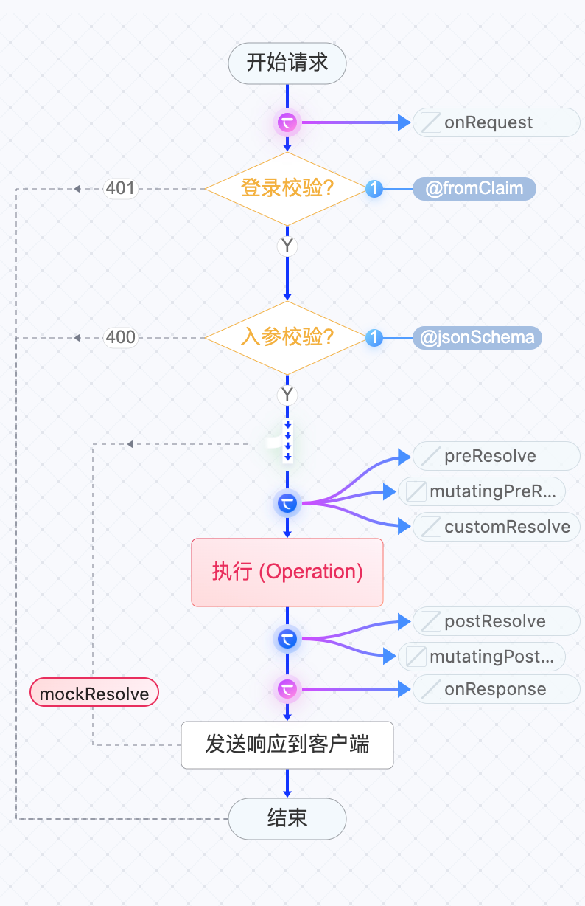

# sealos部署

### 一键部署

1，前往[Sealos模板市场](https://fastdeploy.cloud.sealos.io/)，找到Fireboom，点击“**Deploy**”

<figure><figcaption></figcaption></figure>

2，进入sealos控制台，查看应用

<figure><figcaption></figcaption></figure>

### 访问Fireboom

<figure><figcaption></figcaption></figure>

1，访问控制台

<figure><figcaption></figcaption></figure>

2，访问API端点

```
status ok
```

### 配置Fireboom（可选）

1，查看API外网地址： 设置-> 系统

<figure><figcaption></figcaption></figure>

2，修改为：API端点地址，9991对应的公网地址

* 静态值：选择静态值，设置为 **API端点** 公网域名
* 环境变量：前往 环境变量 ，找到 FB\_API\_PUBLIC\_URL 设置为 **API端点** 公网域名

<figure><figcaption></figcaption></figure>

### 测试API

点击Fireboom控制台右上角的swagger文档图标，进入文档页。

<figure><figcaption></figcaption></figure>

### 高级配置

#### 秘钥保护

fireboom在sealos上的模板默认用dev模式启动，且未开启秘钥保护，公网访问不安全。

可参考如下过程开启秘钥保护。

1，在sealos控制台，打开启动的fireboom服务

2，点击“Update”进入设置页

<figure><figcaption></figcaption></figure>

3，修改Parameters的参数为：

```sh
dev --enable-auth // 开发模式，带秘钥保护

// or

strat // 生产模式，带秘钥保护
```

<figure><figcaption></figcaption></figure>

4，再次访问Fireboom控制台，看到如下界面

<figure><figcaption></figcaption></figure>

#### 查找秘钥

1，进入Terminal

<figure><figcaption></figcaption></figure>

2，查看authentication.key文件

<figure><figcaption></figcaption></figure>

3，在控制台输入秘钥，即可访问

