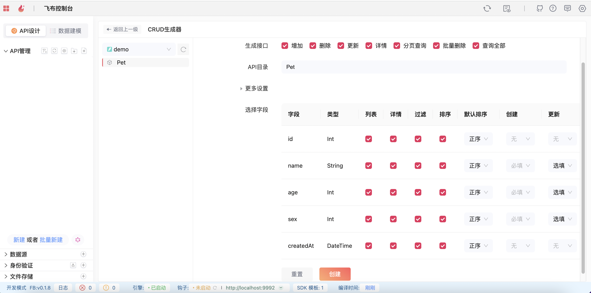

# 管理后台

> 因 Refine 文档较之前有较大变更，所以本文档可能不能适配最新的 Refine

Fireboom 非常适合增删改查类操作，因为 Fireboom 里可以直接对数据模型进行批量创建 API，快速实现增删改查业务，再配合上 Fireboom 自动生成的客户端 SDK，从而可以快速、类型安全的实现管理后台功能。

常见的中后台管理系统中，主要由数据概览、统计、业务数据管理、用户角色菜单配置等几个模块构成。要使用 Fireboom 实现这些功能，我们需要用到 Fireboom 的聚合查询或者`rawQuery`来进行统计查询，批量创建来生成增删改查的接口和 SDK，自定义的 Prisma schema 以及对应的 API 来实现用户角色菜单功能。下面分别介绍具体实现。

## Refine 介绍

在这个示例中，我们使用 [Refine](https://refine.dev/)作为管理后台的开发基础。Refine 是一个基于 React 开发的完整的开发框架，它自带了多数据源管理、身份验证、访问控制、路由、网络管理、i18n 等中后台常用模块，同时对于 CRUD 应用提供快速的、通用的配置，非常适合中后台开发。


## 快速实现增删改查

1. 在 Fireboom 中新建数据源，并添加一个 `Pet` 表

```prisma
model Pet {
  id        Int      @id @default(autoincrement())
  name      String
  age       Int
  sex       Int
  createdAt DateTime @default(now())
}
```

2. 在 Fireboom 控制台点击批量新建，勾选所有接口，生成多个接口，然后多选生成的 API，右键，点击“上线”完成批量上线。


3. 按照 [Refine 官方快速开始](https://refine.dev/docs/getting-started/quickstart/)文档初始化一个 Refine 项目。

```sh
npm create refine-app@latest my-antd-project
```

在命令行弹框中依次选择

```sh
✔ Choose a project template · refine-react
✔ What would you like to name your project?: · admin
✔ Choose your backend service to connect: · data-provider-custom-json-rest
✔ Do you want to use a UI Framework?: · antd
✔ Do you want to add example pages?: · no
✔ Do you need any Authentication logic?: · auth-provider-custom
✔ Do you need i18n (Internationalization) support?: · no
✔ Choose a package manager: · pnpm
✔ Would you mind sending us your choices so that we can improve superplate? · no
```

执行后会显示完成创建的提示

```sh
Success! Created admin at /path/to/your/workspace/admin
```

4. 在 Refine 中添加一个 `dataProvider`

```ts
// dataProvider.ts
import { CrudOperators, DataProvider, LogicalFilter } from "@pankod/refine-core";
import { message } from "antd";
import axios, { AxiosError, AxiosResponse } from "axios";

async function resolveResp(respPromise: Promise<AxiosResponse<any, any>>, dataField = 'data') {
  let msg
  try {
    const resp = await respPromise
    if (resp.status < 300 && resp.status >= 200) {
      return resp.data[dataField]
    }
    if (resp.data) {
      msg = resp.data.message ?? resp.data
    } else {
      msg = resp.statusText
    }
  } catch (e) {
    const err = e as AxiosError
    msg = err.message
  }
  message.error(msg)
  return null
}

export type SimpleGraphqlQueryOperation = 'equals' | 'gt' | 'gte' | 'in' | 'lt' | 'lte' | 'notIn' | 'contains' | 'startsWith' | 'endsWith' | 'mode'

export type GraphqlQueryOperation = SimpleGraphqlQueryOperation | { not: SimpleGraphqlQueryOperation }

/**
 * 把 refine 定义的 operator 转换成 graph 的查询语句里的查询条件
 */
const simpleMatch: Record<Extract<CrudOperators, 'eq' | 'gt' | 'gte' | 'lt' | 'lte' | 'in' | 'startswith' | 'endswith' | 'contains'>, SimpleGraphqlQueryOperation> = {
  eq: 'equals',
  gt: 'gt',
  gte: 'gte',
  lt: 'lt',
  lte: 'lte',
  in: 'in',
  startswith: 'startsWith',
  endswith: 'endsWith',
  contains: 'contains'
}

type SimpleMatchKeys = keyof typeof simpleMatch

function isNull(v: any) {
  return v === null || v === undefined || v === ''
}

function parseOperatorToGraphQuery(operator: LogicalFilter) {
  if (isNull(operator.value) || (Array.isArray(operator.value) && (!operator.value.length || operator.value.every(isNull)))) {
    return
  }
  if (operator.operator in simpleMatch) {
    return {
      [simpleMatch[operator.operator as SimpleMatchKeys]]: operator.value
    }
  }
  switch (operator.operator) {
    case 'between':
      return {
        // 根据业务决定边界
        gte: operator.value[0],
        lte: operator.value[1]
      }
    default:
      break;
  }
}

export const OperationDataProvider = (apiUrl: string = '/operations'): DataProvider => {
  const client = axios.create({
    baseURL: apiUrl, paramsSerializer: {
      serialize(params) {
        return Object.keys(params).reduce<string[]>((arr, key) => {
          const curr = params[key]
          arr.push(`${key}=${JSON.stringify(curr)}`)
          return arr
        }, []).join('&')
      }
    }
  })

  client.interceptors.response.use((resp) => {
    let _message
    if (resp.data) {
      _message = resp.data.message
    } else {
      _message = resp.statusText
    }
    if (_message) {
      message.error(_message)
    }
    return resp
  })

  return {
    async getList({ resource, hasPagination, pagination, metaData, sort, filters }) {
      const params: Record<string, any> = {}
      if (hasPagination) {
        params.take = pagination!.pageSize
        params.skip = pagination!.pageSize! * (pagination!.current! - 1)
      }
      if (sort && sort.length) {
        params.orderBy = sort.map(item => ({ [item.field]: item.order }))
      }
      if (filters && filters.length) {
        params.query = filters.reduce<Record<string, any>>((map, cur) => {
          const filter = cur as LogicalFilter
          map[filter.field] = parseOperatorToGraphQuery(filter)
          return map
        }, {})
      }
      const data = await resolveResp(client.get(`/${resource}/Get${resource}List`, { params }))
      return data ? data : { total: 0, data: [] }
    },
    async getMany({ resource, metaData, ids }) {
      const data = await resolveResp(client.get(`/${resource}/GetMany${resource}`, { params: { ids } }))
      return data ? data.data : []
    },
    async getOne({ id, resource }) {
      const data = await resolveResp(client.get(`/${resource}/GetOne${resource}`, { params: { id: +id } }))
      return data.data
    },
    async create({ resource, variables, metaData }) {
      const data = await resolveResp(client.post(`/${resource}/CreateOne${resource}`, variables))
      return data
    },
    async update({ id, resource, variables, metaData }) {
      const data = await resolveResp(client.post(`/${resource}/UpdateOne${resource}`, { ...variables, id: +id }))
      return data
    },
    async deleteOne({ id, resource, variables }) {
      const data = await resolveResp(client.post(`/${resource}/DeleteOne${resource}`, { ...variables, id: +id }))
      return data
    },
    async custom({ url, method, query, headers, payload}) {
      const data = await resolveResp(client({
        url,
        method,
        headers,
        params: query,
        data: payload
      }))
      return data
    },
    getApiUrl() {
      return client.getUri()
    }
  }
}
```

该文件定义了一个适用于 Refine 的同时又符合 Fireboom 批量新建生成的 API 地址规则的数据源适配器，我们需要按照 Refine 的规则来设置数据源适配器。

```tsx
// App.tsx
import { Refine } from "@refinedev/core";

import dataProvider from "./dataProvider";

const App: React.FC = () => {
    return <Refine dataProvider={dataProvider} />;
};
```

5. 接下来开始添加 Pet 的增删改查页面。按照 Refine 的规则，我们创建`Pet`的`resource`，

```tsx
import { Refine, ResourceProps } from '@pankod/refine-core'
import { PetCreate, PetEdit, PetList, PetShow } from './features/pet'
const resources: ResourceProps[] = [
  {
    name: 'Pet',
    options: { label: '宠物管理' },
    list: PetList,
    create: PetCreate,
    edit: PetEdit,
    show: PetShow
  }
]

const App: React.FC = () => {
    return <Refine dataProvider={dataProvider} resources={resources} />;
};
```

6. 参考 Refine 文档实现前端增删改成页面，页面将根据定义的 `dataProvider`自动调用接口

## 数据概览、统计

使用 Fireboom 超图里的聚合方法，以及 NodeJs 数据源里的 `rawQuery`能力 WIP...

## 用户角色菜单

WIP...

仓库地址：[https://github.com/fireboomio/refine-admin](https://github.com/fireboomio/refine-admin)
